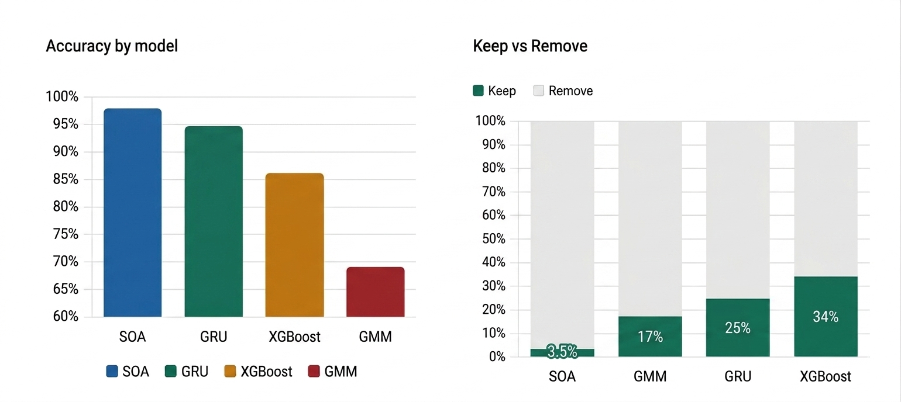
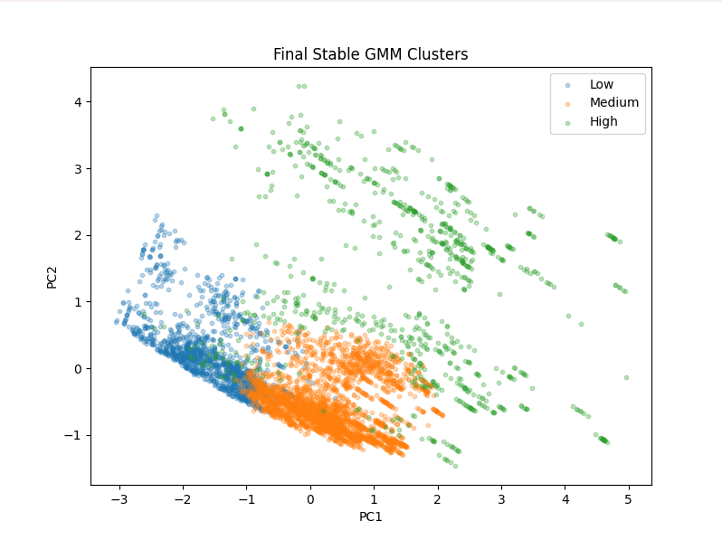
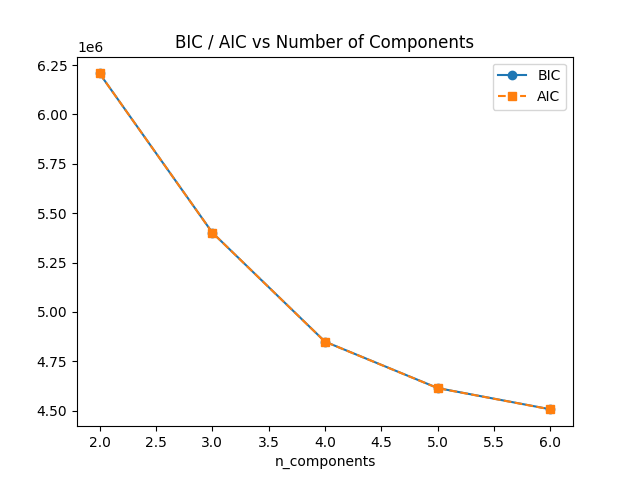
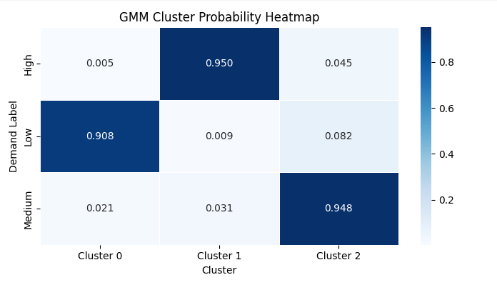
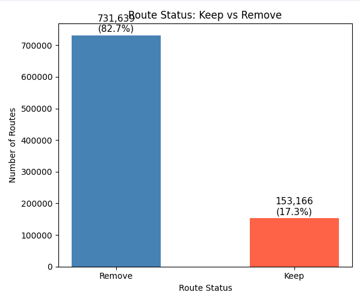
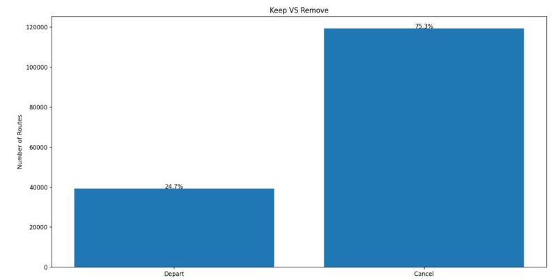
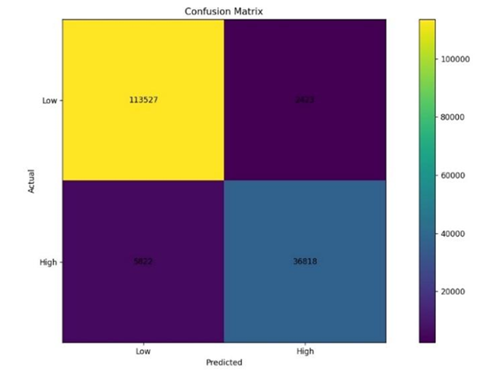
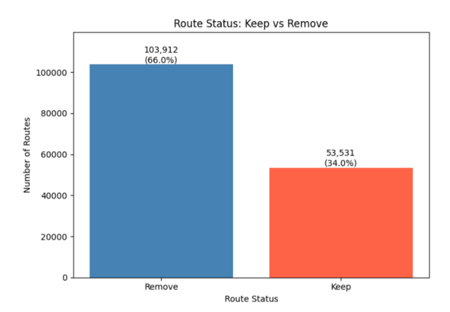
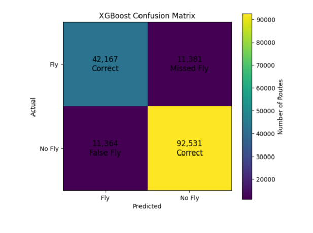
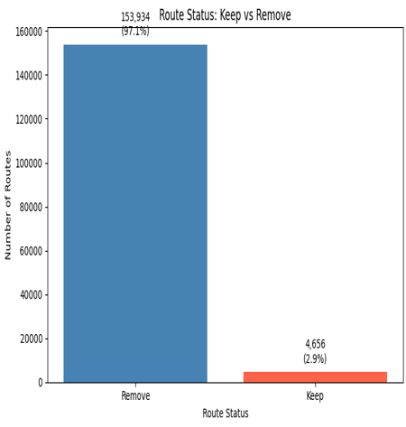

# ✈️ Flight Route Demand Prediction

Four ML models trained on 880K+ BTS flight records to classify airline route demand and recommend which routes to keep or cut. Built as a comparative study across unsupervised clustering, supervised learning, and deep learning benchmarked against a hybrid LSTM-Dense state-of-the-art baseline.

---

# 📌 The Problem

Airlines commit aircraft and crew to routes months in advance. By the time a route proves unprofitable, the damage is done. Most flights need a **75–80% load factor** just to break even, while the airline industry's average net margin sits around **3.6%**.

A handful of underloaded routes can erase profitability.

This project trains machine learning models on historical passenger traffic data to classify routes into:

- **High Demand**
- **Medium Demand**
- **Low Demand**

The models then generate a simplified operational recommendation:

✅ **Keep Route**  
❌ **Remove Route**

---

# 📊 Dataset

## BTS US International Air Travel Statistics

Three source files were merged and processed into one complete ML pipeline.

| File | Description |
|---|---|
| `International_Report_Departures.csv` | Scheduled and charter departure counts per route and month |
| `International_Report_Passengers.csv` | Scheduled and charter passenger counts per route and month |
| `airports.csv` | Airport coordinates used for route distance calculations |

## Dataset Summary

- **Raw Records:** 1.5M+
- **Processed Records:** ~880K rows
- **Scope:** Multi-year US international flight history
- **Source & Assembly:** Abdulmalik Y. Hawsawi

---

# 👥 Team

| Name | Contributions |
|---|---|
| **Abdulmalik Y. Hawsawi** | Team Lead · Dataset sourcing · Full preprocessing pipeline · Data merge · Feature engineering · GMM model |
| **Hamed H. Al-Ansari** | GRU model · Feature engineering |
| **Nasser H. Qahhat** | XGBoost model · Feature engineering |
| **Waleed A. Al-Jaser** | SOA Benchmark (Hybrid LSTM-Dense) |

---

# 🧠 Solutions Implemented

| Model | Type | Developer |
|---|---|---|
| **Gaussian Mixture Model (GMM)** | Unsupervised Machine Learning | Abdulmalik Y. Hawsawi |
| **GRU** | Supervised Deep Learning | Hamed H. Al-Ansari |
| **XGBoost** | Supervised Machine Learning | Nasser H. Qahhat |
| **Hybrid LSTM-Dense** | State-of-the-Art Benchmark | Waleed A. Al-Jaser |

---

# 📈 Results

## Performance Metrics

| Model | Accuracy | Precision | Recall | F1-Score |
|---|---|---|---|---|
| **GMM** | 69% | 73% | 69% | 68% |
| **GRU** | 94.8% | 93.0% | 94.0% | 93.0% |
| **XGBoost** | 85.6% | 78.8% | 78.8% | 78.8% |
| **SOA (LSTM-Dense)** | 98.0% | 99.0% | 98.0% | 98.0% |

> **Note:**  
> The GMM model was trained as an **unsupervised clustering model** without using labels during training.
>
> However, because labeled demand categories were available in the dataset, the discovered clusters were later mapped to the true classes for evaluation purposes. This allowed traditional classification metrics such as Accuracy, Precision, Recall, and F1-Score to be calculated for benchmarking against supervised models.
>
> Additional unsupervised validation methods included:
>
> - Silhouette Score
> - BIC/AIC Analysis
> - Cluster Profile Separation

---

# 📷 Visualizations

## 📊 Overall Model Comparison

### Performance Comparison of Predictive Models


---

# 🔍 Gaussian Mixture Model (GMM)

### GMM Demand Clusters (PCA)


### BIC / AIC vs Number of Components


### GMM Cluster Probability Heatmap


### Keep vs. Remove — GMM


---

# 🤖 GRU Model

### Keep vs. Remove — GRU


### GRU Confusion Matrix


---

# 🌲 XGBoost Model

### Keep vs. Remove — XGBoost


### XGBoost Confusion Matrix


---

# 🧠 SOA Benchmark (Hybrid LSTM-Dense)

### Keep vs. Remove — SOA (LSTM-Dense)


---

# 📂 Project Structure

```text
flight-route-demand-prediction/
├── README.md
├── requirements.txt
├── Preprocessing.py          # Data loading, merging, and cleaning
├── FeatureEngineering.py     # Shared feature engineering pipeline
├── Models/
│   ├── GMM.py
│   ├── GRU_project.py
│   ├── XGBoost.py
│   └── LSTM_Dense22.py
├── images/
│   ├── Comparison_of_models.png
│   ├── gmm_clusters.png
│   ├── bic_aic_curve.png
│   ├── gmm_heatmap.png
│   ├── keep_vs_remove_gmm.png
│   ├── keep_vs_remove_gru.png
│   ├── gru_confusion_matrix.png
│   ├── keep_vs_remove_xgboost.png
│   ├── xgboost_confusion_matrix.png
│   └── keep_vs_remove_soa.png
```

> **Note:**  
> The original dataset was too large to upload to GitHub.  
> To run the project locally, place the required BTS dataset CSV files in your own local data directory before executing the preprocessing pipeline.

---

# ⚙️ Setup

This project was built using **Python 3.10**.

## 1️⃣ Clone the Repository

```bash
git clone https://github.com/yourusername/flight-route-demand-prediction.git
cd flight-route-demand-prediction
```

---

## 2️⃣ Create a Virtual Environment

### Windows

```bash
python -m venv venv
venv\Scripts\activate
```

### Linux / macOS

```bash
python3 -m venv venv
source venv/bin/activate
```

---

## 3️⃣ Install Dependencies

```bash
pip install -r requirements.txt
```

---

# 📦 Requirements Summary

## Deep Learning
- tensorflow==2.21.0
- keras==3.13.2

## Machine Learning
- scikit-learn==1.8.0
- xgboost

## Data Science
- pandas==3.0.1
- numpy==2.4.3

## Visualization
- matplotlib==3.10.8
- seaborn==0.13.2

---

# ▶️ Running the Models

All model scripts depend on:

- `Preprocessing.py`
- `FeatureEngineering.py`

being present in the root directory.

## Navigate to the Models Folder

```bash
cd Models
```

---

## Run Individual Models

### GMM

```bash
python GMM.py
```

### GRU

```bash
python GRU_project.py
```

### XGBoost

```bash
python XGBoost.py
```

### Hybrid LSTM-Dense

```bash
python LSTM_Dense22.py
```

---

# 🔍 Key Insights

## 🧠 The Power of Sequential Learning

The GRU model outperformed XGBoost by nearly **9 percentage points**.

While XGBoost performs exceptionally well on structured tabular data, airline demand is inherently sequential and time-dependent.

The GRU's ability to retain temporal context over a rolling 12-month period allowed it to outperform manually engineered lag features.

---

## 🔬 Unsupervised Pattern Discovery

The Gaussian Mixture Model successfully identified distinct demand clusters without using labels during training.

Key findings:
- Over **10× passenger volume difference** between clusters
- Clear separation between high-demand and low-demand routes
- Statistically meaningful clustering behavior validated through:
  - Silhouette Score
  - BIC/AIC optimization
  - Cluster probability analysis

---

## 🧹 Preprocessing Impact

A cascading grouped-median imputation strategy recovered over:

> **200,000+ rows**

that would otherwise have been discarded due to missing values.

This significantly improved:
- Training robustness
- Dataset coverage
- Model stability

---

# 🏫 Academic Information

**University of Jeddah**  
College of Computer Science & Engineering  

**Course:** CCAI323 Machine Learning  
**Semester:** Fall 2026

---

# 🚀 Future Improvements

Potential future enhancements include:

- Real-time demand prediction
- Transformer-based sequence models
- External economic and tourism indicators
- Weather integration
- Fuel price impact analysis
- Interactive dashboard deployment
- Route profitability forecasting

---

# 📜 License

This project was developed for academic and research purposes.
